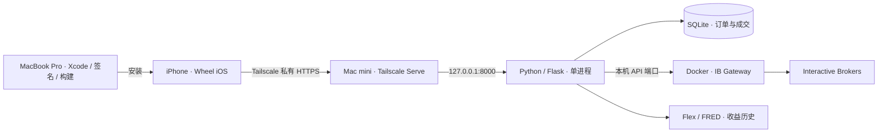

# AllYouNeedIsWheel iOS

**Wheel 策略的原生 iPhone 工作台。** 用一个 App 查看 IBKR 持仓、比较收益、筛选现金担保看跌期权（CSP）和备兑看涨期权（CC），并管理订单。

SwiftUI 构建，支持 iOS 18 及以上、英文／简体中文／繁体中文，以及浅色／深色模式。App 连接你自己运行的后端；IB 登录、行情连接和数据库留在 Mac mini，iPhone 不保存 IB 密码。

项目保留了原有网页界面，作为同一后端的辅助入口。日常使用与界面开发以 **iOS App** 为主。

> 本文对应当前 iOS 开发版本。源码构建安装不等于 App Store 发布；更新 GitHub、更新 Mini 后端和安装手机 App 是三个独立步骤。

## App 能做什么

| 页面 | 主要功能 |
| --- | --- |
| **Portfolio** | 净资产、可折叠现金与流动性、初始保证金及杠杆占比；股票与期权持仓、成交入场价、剩余天数和盈亏；资产分配、持仓分享、平仓与移仓入口。 |
| **Performance** | MTD／YTD／ALL 收益曲线，SPX／NQ100 可选对比，拖动查看日期与收益，日内盈亏及临时收益估算。 |
| **Trade** | CSP → CC 工作流，选择到期日与行权价、查看 bid／mid／ask、价差及 Greeks；合约数量和限价编辑、权利金估算、单笔或批量暂存订单。 |
| **Orders** | 待处理订单、部分及全部成交记录；订单详情、允许范围内的编辑、执行与撤单；成交通知。 |
| **Settings** | Demo、私有 HTTPS 连接、语言、主题及自定义颜色。 |

CC 可用数量依据持股数量、已有空头 CALL 和占用中的卖出订单计算，而不是简单地把全部股票除以 100。持仓的入场价来自可靠匹配的成交记录；无法确定时留空，不用委托价或扣费后持仓成本冒充。

SGOV、VTI、QQQ、SPY、VOO 有专属名称与资产分配动效。VTI／QQQ／SPY／VOO 仍可用于 Trade；SGOV 排除在 Trade 候选之外。装饰动画支持减少动态效果，并在后台或对应视图离开时暂停。

### 数据与订单的含义

- **Demo** 是合成数据和本地模拟操作，不是 IB 模拟盘。连接 Paper Gateway 才是在使用 IB 模拟账户。
- **暂存不等于成交**：Trade 先建立草稿，Orders 的 Execute 才提交到 IB。执行／撤单确认偏好可在订单设置中调整。
- 外部 IB 订单只读；提交结果不确定时锁定进一步写入，先核实 IB 的订单与成交，再解除锁定。不会因超时自动补发交易请求。
- Frozen、过期或缺失报价不会变成可执行的实时价格。连接成功不代表具备全部市场数据权限。
- 收益历史来自 Flex 每日 TWR；SPX／NQ100 是 FRED 每日价格指数，不含股息再投资。日内估算不是正式 TWR，最终以之后的 Flex 报表为准。
- 移仓的两条腿分别暂存、分别执行，不是原子组合单；保证金影响是 IB what-if 估算，不是各持仓可相加的保证金分摊。

## 部署架构



| 设备／组件 | 职责 |
| --- | --- |
| MacBook Pro | 主开发机：Xcode、Simulator、SwiftUI、签名与真机安装。 |
| Mac mini | 长期运行：Docker Gateway、Python 后端、SQLite、Tailscale。 |
| iPhone | 查看和操作 App，通过 Tailnet 访问 Mini。 |
| GitHub | 正式代码来源；换电脑前 Commit → Push，另一台 Pull 后再开发。 |

**下文的 Docker 只运行 IB Gateway。Wheel 后端运行在 Mini 的 Python 虚拟环境里**，不是整个项目都放进一个容器。仓库没有一键全栈 Docker 部署脚本。

## 1. 准备环境

- **Mini**：Git、Python 3.10+、Docker Desktop、Tailscale；保持联网，避免系统休眠。
- **Pro**：Git、能编译本项目并支持目标设备的 Xcode、Apple ID／开发签名；真机需 iOS 18+。
- **iPhone**：Tailscale，与 Mini 加入同一 Tailnet。
- **IBKR**：有效的 Gateway 登录、目标账户及需要的行情权限。先用 Paper／只读路径验证。

先在 Mini 克隆并安装后端依赖：

```sh
mkdir -p "$HOME/Projects"
cd "$HOME/Projects"
git clone https://github.com/WahBun/AllYouNeedIsWheel.git
cd AllYouNeedIsWheel
python3 -m venv .venv
source .venv/bin/activate
python -m pip install -r requirements.txt
cp connection.json.example connection.json
```

已有安装不要覆盖配置或数据库。先查看 `git status`；干净工作区再用 `git pull --ff-only`。

## 2. Mini：Docker 运行 IB Gateway

使用 [gnzsnz/ib-gateway-docker](https://github.com/gnzsnz/ib-gateway-docker) 的镜像；它是独立上游项目。下面为首次部署的 Paper／只读示例，不是现有服务的重置命令。

在仓库外创建私有目录，例如 `~/Services/wheel-gateway`。保存 `compose.yaml`：

```yaml
services:
  ib-gateway:
    image: ghcr.io/gnzsnz/ib-gateway:stable
    restart: unless-stopped
    environment:
      TWS_USERID: ${TWS_USERID:?Set TWS_USERID}
      TWS_PASSWORD: ${TWS_PASSWORD:?Set TWS_PASSWORD}
      TRADING_MODE: paper
      READ_ONLY_API: "yes"
      VNC_SERVER_PASSWORD: ${VNC_SERVER_PASSWORD:?Set VNC_SERVER_PASSWORD}
      TWS_SETTINGS_PATH: /home/ibgateway/tws_settings
    ports:
      - "127.0.0.1:4002:4004"
      - "127.0.0.1:5900:5900"
    volumes:
      - gateway-settings:/home/ibgateway/tws_settings
volumes:
  gateway-settings:
```

同目录新建 `.env`，仅在 Mini 本地填写：

```dotenv
TWS_USERID=YOUR_PAPER_USERNAME
TWS_PASSWORD=YOUR_PAPER_PASSWORD
VNC_SERVER_PASSWORD=YOUR_PRIVATE_VNC_PASSWORD
```

```sh
chmod 600 .env
docker compose pull
docker compose up -d
docker compose ps
```

在 Mini 上用屏幕共享／VNC 客户端连接 `vnc://127.0.0.1:5900`，检查 Gateway 登录与 API 设置，按要求完成 IB Key／双重验证。不要把 VNC 或 IB API 端口暴露到公网。Docker 启动成功不等于 Gateway 已登录。

该镜像的 **Paper 转发端口是容器内 4004 → Mini 4002**；Live 对应容器内 4003 → Mini 4001。不要把容器转发端口与 Gateway 内部端口混用。Apple Silicon 应选择上游支持 ARM64 的镜像版本；验证成功后固定版本或 digest，避免无计划升级。端口与配置细节见[上游部署说明](https://github.com/gnzsnz/ib-gateway-docker#ports)。

Docker Desktop 需要随用户登录启动；容器重启策略不能代替它，也不能绕过 IB 身份验证。不要为 Wheel 再启动一个与既有账户会话冲突的 Gateway。

## 3. Mini：连接 Python 后端

编辑项目内的 `connection.json`，与上一步保持一致：

```json
{
  "host": "127.0.0.1",
  "port": 4002,
  "client_id": 1,
  "readonly": true,
  "account_id": "YOUR_PAPER_ACCOUNT_ID",
  "db_path": "options_dev.db"
}
```

`client_id` 要固定且不与其他应用冲突；`account_id` 必须是实际目标账户。文件名不决定 Paper／Live，实际 Gateway 会话、端口及账户才决定。

```sh
source .venv/bin/activate
python run_api.py
```

另一个终端验证：

```sh
curl --fail http://127.0.0.1:8000/health
curl --fail http://127.0.0.1:8000/api/portfolio/bootstrap
curl --fail http://127.0.0.1:8000/api/options/market-session
```

`/health` 只说明 HTTP 服务正常；还要确认持仓接口返回正确账户的数据。不要把账户响应或未经脱敏的日志放到公开 issue。

后端维持 **一个进程、八个 HTTP 线程、一个串行 IB 执行线程**。相同读取可以合并等待，写入不合并、不自动重试。不要通过增加 Gunicorn worker 数来提速，也不要重复启动后端。

准备开启交易时，分别核对 Gateway 的 Read-Only API、后端 `readonly` 和目标账户。使用 Live 时还需对应的 Gateway 会话与端口；`python run_api.py --realmoney` 仅选择 `connection_real.json`，本身不会证明当前是正确实盘账户。

## 4. Mini → iPhone：Tailscale 私有 HTTPS

Mini、Pro 和 iPhone 加入同一 Tailnet，访问策略只允许所需设备访问。开启 MagicDNS 和 HTTPS 支持，然后在 Mini 执行：

```sh
tailscale status
tailscale serve --bg --https=443 http://127.0.0.1:8000
tailscale serve status
```

使用 Serve 输出的**完整 HTTPS 域名**，例如：

```text
https://YOUR-MINI.YOUR-TAILNET.ts.net
```

在 iPhone 保持 Tailscale 连接，用 Safari 打开该域名的 `/health`，再在 Wheel → Settings 填入同一根地址，点击 Connect。外出使用前再通过蜂窝网络验证一次。

不要使用 Funnel 或路由器公网端口转发；不要跳过 TLS 证书验证。`--bg` 保存后台 Serve 配置，但仍依赖 Mini 和 Tailscale 在线。域名证书会进入公开证书透明度日志，因此设备名不宜包含私人信息。见 [Tailscale Serve 官方说明](https://tailscale.com/docs/features/tailscale-serve)和[命令参考](https://tailscale.com/docs/reference/tailscale-cli/serve)。

## 5. Pro：构建并安装 iOS App

在 Pro 克隆同一个仓库，打开 `ios/Wheel.xcodeproj`。App 无外部 Swift 包依赖。

在 `ios/Signing.xcconfig` 同目录创建被 Git 忽略的 `Signing.local.xcconfig`：

```xcconfig
DEVELOPMENT_TEAM = YOUR_TEAM_ID
PRODUCT_BUNDLE_IDENTIFIER = com.yourname.wheel
```

在 Xcode 的 Signing & Capabilities 确认自己的 Team 与自动签名。保持同一 bundle identifier 才是对现有 App 的更新；换标识会成为另一个安装。

1. 首次用线连接并解锁 iPhone，确认信任，按系统要求启用开发者模式。
2. 选择自己的 iPhone 作为运行目标，构建安装。
3. 常规体验选择 **Wheel Wireless** scheme：Debug 构建，但启动不附加 LLDB，减少无线调试带来的启动与交互开销。
4. 需要断点和调试时使用 **Wheel** scheme。
5. App 首次从 Demo 开始；填写前一节的 HTTPS 地址后连接真实后端。

### 无线 Run

先完成一次有线配对，在 Xcode 的 Devices and Simulators 确认设备可用／网络连接已启用，再拔线。Pro 与 iPhone 应位于允许设备互访的同一局域网；访客 Wi-Fi、客户端隔离或 VPN 规则可能阻断调试。

手机屏幕镜像的系统要求与 Xcode 无线安装不是同一件事。Tailscale 解决 App 到 Mini 的连接，也不等于已经配置好 Xcode 到 iPhone 的无线调试。

Simulator 可直接运行 Demo；它不证明真机签名、无线连接或实盘行情已验证。签名账号的有效期与设备限制以 Apple 当前规则为准。

## 6. 配置 Performance 收益历史

Portfolio 能读取不代表收益历史已配置。Mini 还需要 IBKR Flex 的每日 Change in NAV，包含 TWR、From／To Date 和 Ending Value，并按日拆分；账户需与 Gateway 配置一致。

在 Mini 创建私有文件：

```text
~/Library/Application Support/Wheel/performance/config.json
```

```json
{
  "token": "YOUR_FLEX_TOKEN",
  "query_id": "YOUR_FLEX_QUERY_ID",
  "account_id": "YOUR_CONFIGURED_GATEWAY_ACCOUNT",
  "history_path": "/ABSOLUTE/PRIVATE/PATH/performance-history.sqlite3"
}
```

先创建父目录，将文件权限设为 `600`；`history_path` 的父目录也应存在且可写。也可用后端环境变量 `WHEEL_PERFORMANCE_CONFIG` 指定另一个私有配置文件，或用 `report_path` 导入已有 CSV／XML。

Token 不放进 App、Git 或 `connection.json`。该连接配置存在旧式日志输出，不能当作 Flex 密钥容器。收益档案要单独备份；ALL 展示实际保存的历史，不会凭空补全建仓以来缺失的日期。报表格式、缓存与估算边界见 [Performance 配置说明](docs/PERFORMANCE.md)。

## 7. 长期运行与更新

Mini 的 Python 后端可用 LaunchAgent 在用户登录后启动，完整 plist、加载与停止命令见 [Mini 运维指南](docs/MAC_MINI_TAILSCALE.md#3-macos-登录后自启动)。默认加载 `connection.json`；若实际使用其他文件，必须在 LaunchAgent 的 `EnvironmentVariables` 中明确配置 `CONNECTION_CONFIG`。自定义 Flex 路径同样通过环境变量传入。

重启 Mini 后，FileVault 解锁、用户登录、Docker Desktop、Gateway 登录、Tailscale 和后端分别确认。不要把“容器自动重启”当成全链路已恢复。

更新顺序：

1. Pro 完成修改与检查 → Commit → Push；GitHub 是正式版本来源。
2. Mini 检查工作区，备份本地连接配置、订单数据库和收益历史；SQLite 使用 backup API／`.backup`，不要仅复制运行中的主文件。
3. Mini `git pull --ff-only`，按需更新依赖并测试；选择没有订单正在提交的窗口重启唯一后端。
4. 验证本机健康与持仓读取，再验证 Tailnet HTTPS；涉及 API 变化时先更新后端，后安装 App。
5. Pro 拉取同一版本，重新构建安装到手机。核对账户、持仓、报价状态和订单记录。

不把配置、IB/Flex 凭据、数据库、日志、私有地址和个人签名信息提交到 Git。不要用 `git reset --hard`、删除数据库或重置全部 Serve 配置处理更新冲突。

## 常见问题

| 现象 | 排查顺序 |
| --- | --- |
| App 无法连接 | Mini 本机 `/health` → 持仓接口 → 两端 Tailscale → HTTPS 域名与策略。 |
| 安全连接失败／`-1200` | Safari 打开同一地址，核对时间、证书、Tailscale 和代理干扰；不要关闭证书验证。 |
| 有持仓但没有报价 | Gateway 登录、行情权限、合约是否可报价、市场状态；旧／冻结数据不是实时价。 |
| 收益图为空 | Flex 配置、账户对应关系、每日 TWR 与本地收益档案；Demo 不提供真实收益历史。 |
| HTTP 503／首次报价慢 | 串行 IB 队列或合约首次确认可能耗时；等待读取恢复，不要重复提交交易。 |
| 无线 iPhone 不可用 | 首次配对、解锁、同网段设备互访、VPN 和路由器隔离规则。 |
| 无线 Run 后启动卡顿 | 使用不附加调试器的 Wheel Wireless；调试时切回 Wheel。 |
| 订单状态不确定 | 核对 IB 的准确订单与部分成交，再处理锁定；不自动补单。 |

Trade 自动报价参考 NYSE 常规交易日历，包括假期、提前收盘与夏令时；这不是所有股票、期权或延长交易时段的交易许可判断。Performance 的盘中延长曲线仍是有限条件下的估算。

## 开发与验证

```sh
# 后端：在已安装依赖的虚拟环境中执行，使用项目 mocks
python -m unittest discover -s tests
node --test tests/*.js

# iOS：先列出可用模拟器，再将 SIMULATOR_ID 替换为本机目标
xcrun simctl list devices available
xcodebuild -project ios/Wheel.xcodeproj -scheme Wheel \
  -destination 'platform=iOS Simulator,id=SIMULATOR_ID' test

git diff --check
```

模拟测试不提交真实订单。通过编译和回归不等于已验证盘中延迟、真实成交、所有网络故障或所有 iOS 设备。

```text
iOS 开发入口：ios/Wheel.xcodeproj
原生界面与状态：ios/Wheel/
iOS 回归：ios/WheelTests/
后端路由与服务：api/
IB 连接与配置：core/、config.py
订单数据库：db/
后端与网页回归：tests/
辅助网页：frontend/
部署与数据说明：docs/
```

更多开发细节见 [iOS 指南](ios/README.md)。原网页与 App 共用后端，适合辅助核对；浏览器偏好不会自动迁移到 App。

## License & Credits

[Apache License 2.0](LICENSE)。项目基于 [xiao81/AllYouNeedIsWheel](https://github.com/xiao81/AllYouNeedIsWheel) 延续开发。感谢 [ib_async](https://github.com/ib-api-reloaded/ib_async)、SwiftUI／Charts、Flask，以及 [IB Gateway Docker](https://github.com/gnzsnz/ib-gateway-docker) 与 [Tailscale](https://tailscale.com/) 提供的基础工具。
